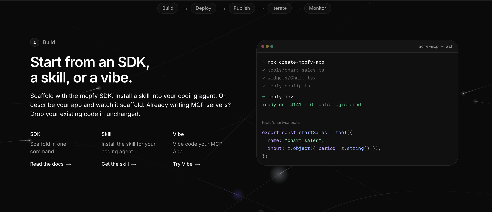
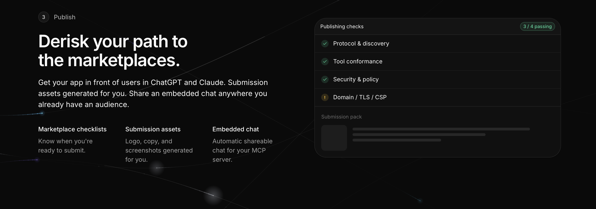
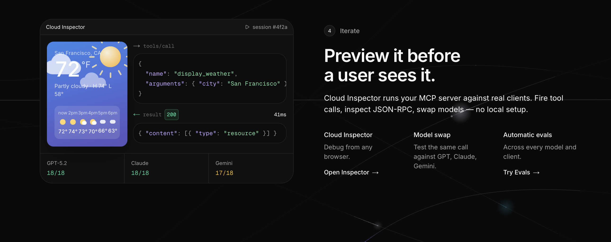
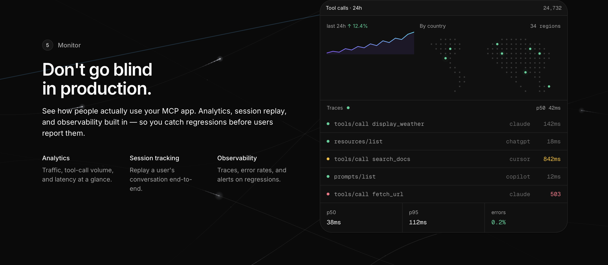

<div align="center">


⚡ Deploy in minutes | 🔐 OAuth built in | ☁️ Remote MCP ready | 🤖 Works with Claude, OpenAI & any other client

A SDK for building **MCP tools, prompts, resources, and widgets**.

Supports **HTTP**, **stdio**, and React widgets that work across **MCP-UI**, **MCP Apps**, and **OpenAI Apps SDK**.

```bash
npx create-mcpfy-app@latest my-server
```

[](https://www.npmjs.com/package/mcpfy-sdk)
[](https://mcpfy.ai)
[](./LICENSE)
[](./typescript)

</div>

---

## Why mcpfy?

The official MCP SDK is powerful, but getting your first server running still means writing a fair amount of setup code.

mcpfy stays close to that SDK and drops the repetitive parts.

- 🚀 Build an MCP server in minutes
- 🛠️ Tools, prompts, and resources with a small API
- 🎨 Widgets as React folders: `server.tool({ widget: "weather" })` — one UI for MCP-UI, MCP Apps, and Apps SDK
- 🌐 HTTP and stdio built in
- 🔓 Full access to the official SDK when you need it

---

## Quick start

```bash
npx create-mcpfy-app@latest my-server
cd my-server
npm run dev
```

Default scaffold: a **weather widget** (`src/widgets/weather`, linked with `widget: "weather"`). The tool fetches Open-Meteo; the widget looks up cities with `callTool`. Pass `--no-widget` for the tools-only server (`add`, a greeting resource, and a `greet` prompt). `-y` skips the TUI.

Or write a server yourself:

```ts
import { MCPServer, object } from "mcpfy-sdk/server";
import { z } from "zod";

const server = new MCPServer({ name: "my-server", version: "1.0.0" });

server.tool(
  {
    name: "add",
    description: "Add two numbers",
    schema: z.object({ a: z.number(), b: z.number() }),
    outputSchema: z.object({ sum: z.number() }),
  },
  async ({ a, b }) => object({ sum: a + b })
);

// React UI: src/widgets/weather/main.tsx — hooks from mcpfy-sdk/widget
server.tool(
  {
    name: "weather",
    description: "Look up current weather for a city",
    schema: z.object({ city: z.string().default("San Francisco") }),
    outputSchema: z.object({ city: z.string(), temperatureC: z.number() }),
    widget: {
      dir: "weather",
      // If the widget fetch()es another origin (ChatGPT + Claude):
      // csp: { connectDomains: ["https://api.example.com"] },
    },
  },
  async ({ city }) => {
    const geo = await fetch(
      `https://geocoding-api.open-meteo.com/v1/search?name=${encodeURIComponent(city)}&count=1`
    ).then((r) => r.json());
    const place = geo.results[0];
    const forecast = await fetch(
      `https://api.open-meteo.com/v1/forecast?latitude=${place.latitude}&longitude=${place.longitude}&current=temperature_2m`
    ).then((r) => r.json());
    return object({ city: place.name, temperatureC: forecast.current.temperature_2m });
  }
);

await server.listen(); // stdio; { transport: "http" } for HTTP
```

Widgets: `mcpfy dev` / `mcpfy build`. There is no HTML file and no `server.widget()` in new apps.

```ts
import { MCPClient } from "mcpfy-sdk/client";

const client = new MCPClient({
  mcpServers: {
    local: { command: "npx", args: ["tsx", "src/server.ts", "--stdio"] },
  },
});

const session = await client.createSession("local");
console.log(await session.callTool("add", { a: 2, b: 3 }));
await client.closeAllSessions();
```

---

## From the SDK to production

The SDK is the build step. [mcpfy.ai](https://mcpfy.ai) carries the same server through the rest of the pipeline — deploy, publish, iterate, monitor — so you do not assemble a host, a test harness, an analytics stack and a submission pack yourself.

### Build

Scaffold with the SDK, install a skill into your coding agent, or describe the app and let it scaffold. Already writing MCP servers? Existing code drops in unchanged.



### Publish

Marketplace checklists tell you when a server is ready for ChatGPT and Claude, and the submission assets are generated for you.



### Iterate

Cloud Inspector runs the server against real clients from a browser. Fire tool calls, read the JSON-RPC, and swap models with no local setup.



### Monitor

Traffic, tool-call volume, latency and error rates once it is live, with session replay end to end.



---

## Documentation

- 📖 **TypeScript workspace** — [`typescript/README.md`](./typescript/README.md)
- 📦 **API** — [`typescript/packages/mcpfy/README.md`](./typescript/packages/mcpfy/README.md)
- 🚀 **Tools-only example** — [`typescript/examples/hello-world`](./typescript/examples/hello-world) (`--no-widget`)
- 🎨 **Widget example** — [`typescript/examples/widget-weather`](./typescript/examples/widget-weather) (default scaffold)

---

## Roadmap

[`ROADMAP.md`](./ROADMAP.md)

---

## Contributing

mcpfy is built in the open, and contributions are welcome.

Have an idea that would improve the project? Fork the repo and open a pull request. Found a bug or want to request a feature? Open an issue. If you find mcpfy useful, a star helps others discover it.

1. Fork the Project
2. Create your Feature Branch (`git checkout -b feature/AmazingFeature`)
3. Commit your Changes (`git commit -m 'Add some AmazingFeature'`)
4. Push to the Branch (`git push origin feature/AmazingFeature`)
5. Open a Pull Request

---

## License

Distributed under the [MIT License](./LICENSE).
